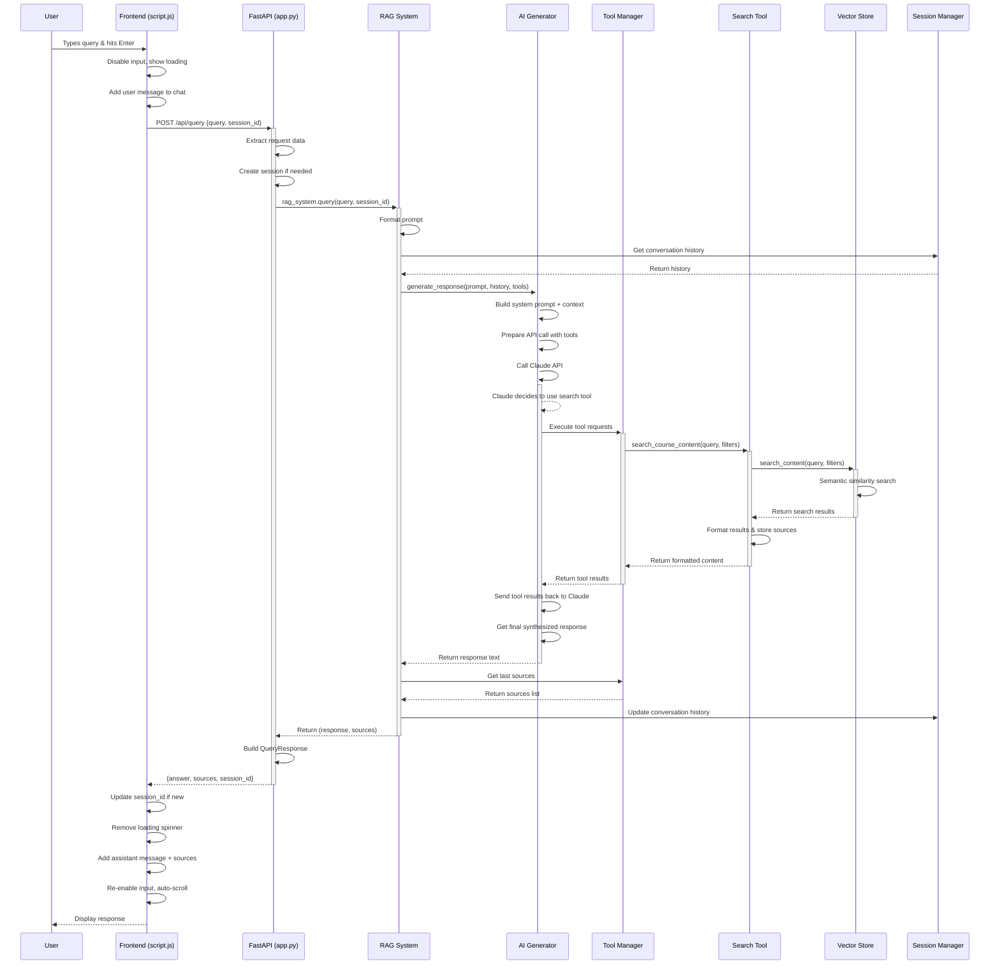

# RAG System Query Processing Flow



## Component Breakdown

### Frontend Layer
```
┌─────────────────────────────────────┐
│           Frontend (JS)             │
├─────────────────────────────────────┤
│ • Event handling (Enter/Click)      │
│ • Input validation & UI state       │
│ • Loading states & user feedback    │
│ • Message rendering (Markdown)      │
│ • Source display (collapsible)      │
│ • Session management (client-side)  │
└─────────────────────────────────────┘
```

### API Layer
```
┌─────────────────────────────────────┐
│          FastAPI Server             │
├─────────────────────────────────────┤
│ • CORS & middleware                 │
│ • Request validation (Pydantic)     │
│ • Session ID management             │
│ • Error handling & HTTP responses   │
│ • Static file serving               │
└─────────────────────────────────────┘
```

### RAG Orchestration
```
┌─────────────────────────────────────┐
│           RAG System                │
├─────────────────────────────────────┤
│ • Query preprocessing               │
│ • Component coordination            │
│ • Prompt engineering                │
│ • Response post-processing          │
│ • Source aggregation                │
└─────────────────────────────────────┘
```

### AI Processing
```
┌─────────────────────────────────────┐
│          AI Generator               │
├─────────────────────────────────────┤
│ • Claude API integration            │
│ • Tool execution orchestration     │
│ • Context management                │
│ • Response synthesis                │
│ • Temperature & parameter control   │
└─────────────────────────────────────┘
```

### Search & Retrieval
```
┌─────────────────────────────────────┐
│      Search Tools & Vector Store    │
├─────────────────────────────────────┤
│ • Semantic similarity search        │
│ • Course/lesson filtering           │
│ • Result ranking & formatting       │
│ • Source tracking                   │
│ • ChromaDB integration              │
└─────────────────────────────────────┘
```

### Data Flow Summary

```
User Input → Frontend → API → RAG System → AI Generator
                                    ↓
                            Tool Manager → Search Tool → Vector Store
                                    ↓
                            Claude API ← Tool Results ← Search Results
                                    ↓
                          Final Response → Sources → Frontend → User
```

## Key Features

- **Tool-Driven Search**: Claude autonomously decides when to search
- **Session Persistence**: Maintains conversation context across queries  
- **Source Attribution**: Tracks and displays relevant course materials
- **Error Resilience**: Graceful handling at each processing stage
- **Real-time Feedback**: Loading states and progressive UI updates